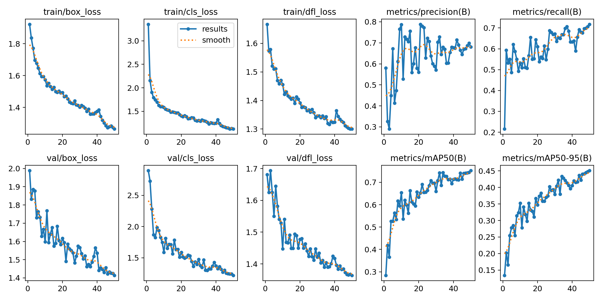
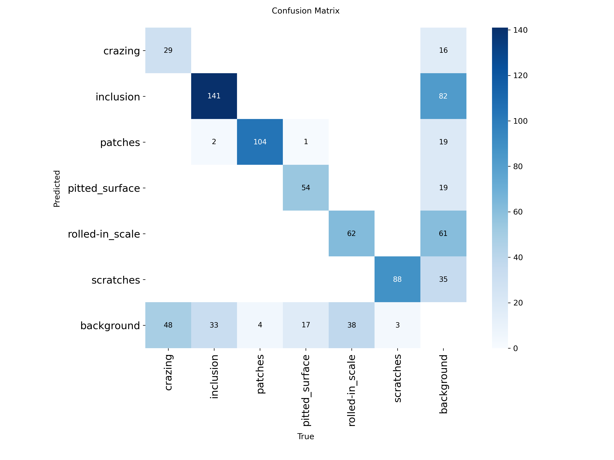

# Industrial Surface Defect Classification & Localization

Deep learning pipeline for automated detection of steel surface defects using **EfficientNet-B0** for image classification and **YOLOv8n** for defect localization.

## Overview

This project uses the **NEU-DET steel surface defect dataset**, containing **1,800 images across 6 defect classes**:

* Crazing
* Inclusion
* Patches
* Pitted Surface
* Rolled-in Scale
* Scratches

Two computer vision tasks are implemented:

1. **Defect Classification** — EfficientNet-B0
2. **Defect Localization** — YOLOv8n

## Results

### EfficientNet-B0 Classification

| Metric         | Test Result |
| -------------- | ----------: |
| Accuracy       |  **98.15%** |
| Macro F1-Score |  **98.15%** |
| Test Images    |         270 |

The model correctly classified **265 out of 270** held-out test images.

### YOLOv8n Defect Localization

| Metric      | Test Result |
| ----------- | ----------: |
| mAP@50      |  **72.48%** |
| mAP@50-95   |  **42.81%** |
| Precision   |  **64.65%** |
| Recall      |  **72.38%** |
| Test Images |         270 |

### Training Performance



### Confusion Matrix



### Precision-Recall Curve


### Sample Predictions

Example detections are available in [`results/predictions/`](results/predictions/).

## Dataset Split

The dataset was divided into:

* **Training:** 1,260 images (70%)
* **Validation:** 270 images (15%)
* **Testing:** 270 images (15%)

Pascal VOC XML bounding-box annotations were converted into normalized YOLO annotation format for object detection.

## Project Structure

```text
Industrial-Surface-Defect-Detection/
├── notebooks/
│   ├── 01_opencv_preprocessing_feature_extraction.ipynb
│   ├── 02_defect_classification_efficientnet.ipynb
│   └── 03_defect_localization_yolov8.ipynb
├── models/
│   ├── efficientnet_best.pth
│   └── yolov8n_neu_defect_best.pt
├── results/
│   ├── results.png
│   ├── confusion_matrix.png
│   ├── PR_curve.png
│   └── predictions/
├── README.md
├── requirements.txt
└── .gitignore
```

## Tech Stack

**Python · PyTorch · EfficientNet-B0 · YOLOv8 · OpenCV · torchvision · timm · scikit-learn**

## Training

### EfficientNet-B0

Transfer learning was used for six-class surface defect classification. The model was trained for **5 epochs**, with the best validation checkpoint retained for testing.

### YOLOv8n

YOLOv8n was fine-tuned for defect localization using converted NEU-DET bounding-box annotations.

* Epochs: **50**
* Batch size: **16**
* Train/Validation/Test split: **70/15/15**
* Best checkpoint selected using validation performance

Final performance was evaluated separately on the **held-out test set**.

## Installation

```bash
pip install -r requirements.txt
```

## Future Improvements

* Experiment with larger YOLO architectures
* Improve detection of difficult defect classes
* Apply stronger data augmentation
* Deploy as an interactive industrial inspection application
